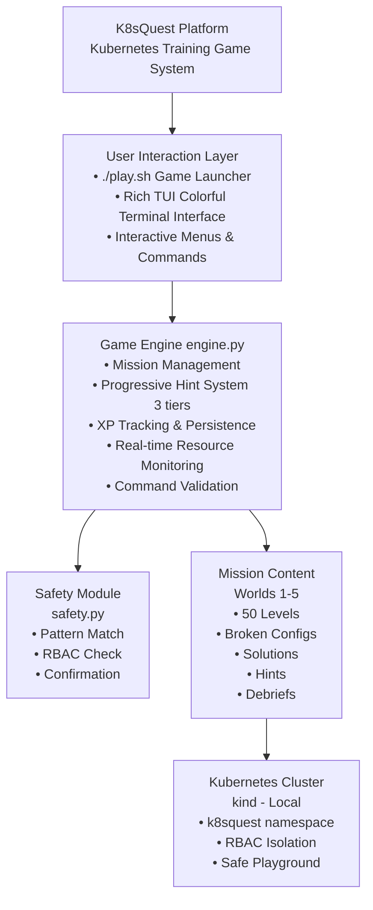
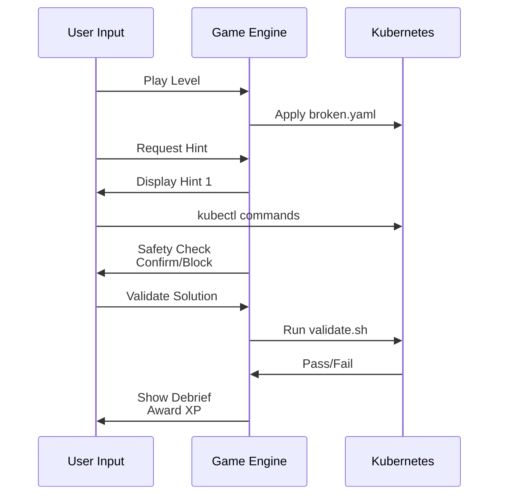
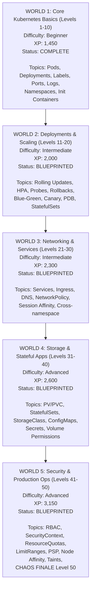

# K8sQuest Architecture Overview

## Platform Architecture



## Data Flow Diagram



## Level Structure (Template)

```
worlds/
└── world-X-name/
    └── level-Y-topic/
        ├── mission.yaml          ← Metadata (name, XP, difficulty, concepts)
        ├── broken.yaml          ← Intentionally broken K8s resources
        ├── solution.yaml        ← (Optional) Fixed version
        ├── validate.sh          ← Pass/fail test script
        ├── hint-1.txt           ← Observation hint
        ├── hint-2.txt           ← Direction hint
        ├── hint-3.txt           ← Near-solution hint
        └── debrief.md           ← Post-mission learning
                                   • What happened
                                   • How K8s behaved
                                   • Mental model
                                   • Real-world incident
                                   • Commands learned
```

## Safety System Architecture

```mermaid
graph TB
    A[Safety Guard Layers]

    B[Layer 1: Command Pattern Validation<br/>safety.py<br/>• Regex pattern matching<br/>• Dangerous commands: delete namespace, --all flags, etc.<br/>• Severity levels: CRITICAL block | WARNING confirm<br/>• Rich UI for user feedback]

    C[Layer 2: RBAC Enforcement<br/>Kubernetes<br/>• ServiceAccount: k8squest-player<br/>• Namespace: k8squest isolated<br/>• Role: Full access ONLY in k8squest namespace<br/>• ClusterRole: Read-only cluster-wide]

    D[Layer 3: Namespace Isolation<br/>Kubernetes<br/>• All operations scoped to k8squest namespace<br/>• System namespaces protected kube-system, default<br/>• Resource quotas can limit usage]

    A --> B
    B -->|if allowed| C
    C --> D
```

## World Progression Path



## Technology Stack

| Component           | Technology                              |
|---------------------|----------------------------------------|
| Game Engine         | Python 3.x                              |
| UI Framework        | rich (Python TUI library)               |
| Kubernetes          | kind (Kubernetes in Docker)             |
| Container Runtime   | Docker Desktop                          |
| CLI Tool            | kubectl                                 |
| Data Format         | YAML (configs), JSON (progress)         |
| Scripting           | Bash (automation, validation)           |
| Testing             | Python unittest-style (pytest patterns) |
| Version Control     | Git (.gitignore configured)             |
| Isolation           | Python venv (dependency management)     |

## Key Metrics Dashboard

**K8sQuest Statistics**

| Metric                  | Value                               |
|------------------------|-------------------------------------|
| Total Levels           | 50 (10 complete, 40 blueprinted)   |
| Total XP Available     | 11,500                              |
| Worlds                 | 5                                   |
| Lines of Code (Engine) | ~1,500                              |
| Lines of Documentation | ~3,000+                             |
| Safety Test Coverage   | 20 tests, 100% passing              |
| Setup Time             | ~5 minutes                          |
| Avg Level Duration     | 10-15 minutes                       |
| Learning Outcomes      | CKA exam preparation level          |

Created for Kubernetes learners worldwide